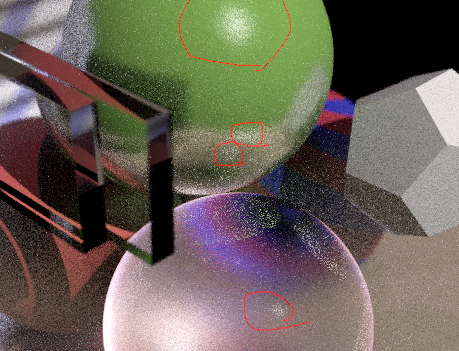
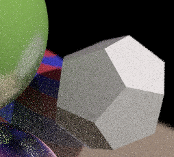

## 그래픽스 HW5 보고서

### 대표 이미지


### 이미지 재현법

1. Rust 를 설치합니다.
2. 다음 커맨드를 실행합니다
```
cargo run --release
```

3. 프로젝트 루트에 ```output.png``` 파일이 생성됩니다. 렌더링은 incremental 하게 진행되므로 적당히 만족스런 이미지가 생성되면 프로그램을 멈춰도 좋습니다.

### 구현된 기능과 미구현 기능

#### 구현된 기본기능

* Ray tracing spheres [10 points]

* Ray tracing polygons [10 points

* Recursive reflection [10 points]

* Recursive refraction[10 points]

* Phong illumination [10 points] 

* Importing geometry files such as OBJ [5 points]

* Export image files [5 points]

* Texture mapped spheres and polygons [10 points

* Report [15 points]

* Representative pictures [15 points]

#### 미구현된 기본기능
없음
#### 구현된 추가기능
* Distributed ray tracing(산란, Depth of field)
* Bump mapping (Normal mapping)

### 기능 설명

#### 구체의 광선 추적


대표 이미지에서 네개의 구체를 볼 수 있다시피 구체의 광선을 추적할 수 있다. 구체의 기하적 속성은 코드 내에서 다음과 같이 중점과, 반경으로 정의된다. 

```rust
// src/primitives.rs:21
pub struct SphereGeometry {
    pub center: Point3<f32>,
    pub radius: f32,
}
```

광선이 Or에서 시작해 d 방향으로 날아갈 때, 원점 Os와 반지름 R을 가진 구체와 광선이 마주치는지는 광선과 원점간의 거리가 구의 반지름보다 작은지 확인하면 된다(``` D = (Os - Or) x d < R```). 광선의 시작지점에서 출발해 d 방향으로 날아가는 거리 t는 ```t = d * (Os - Or) +- sqrt(r^2 - D^2)``` 로 계산되고 이에 따라 ```Or + t * d``` 지점에서 광선과 마주치게 된다.

### 삼각형 광선의 추적


대표이미지에서 구체를 제외한 모든 도형들은 삼각형으로 표현된다. 위 그림은 직육면체와 같은 도형이 어떻게 삼각형으로 구성되어있는지를 설명하기 위해 렌더한 이미지 위에 선을 그린것이다. 코드 내에서 삼각형은 다음과 같이 세개의 꼭지점 좌표, 각 꼭지점에서의 법선, 그리고 UV로 구성된다.

```rust
// src/geometric.rs:43
pub struct PositionNormalUV {
    pub position: Point3<f32>,
    pub normal: Vector3<f32>,
    pub uv: Point2<f32>,
}

// src/primitives.rs:26
pub struct Triangle<T> {
    pub object_index: ObjectIndex,
    pub vertices: [T; 3],
}
// Triangle<PositionNormalUV> 와 같이 사용된다.

```

광선의 원점이 Or이고, 광선의 진행방향이 d, 삼각형이 만드는 평면이 ```Nx * x + Ny * y + Nz * z = D``` 일 때, 광선이 ```t = (D - N * Or) / N * d``` 만큼 진행하면 평면상에 있는 점 ```H = Or + d * t```존재하게 된다. 이 점이 삼각형의 세 점과 만드는 barycentric coordinate 의 원소가 모두 0보다 클 때 삼각형 내부에 존재하게 되어 삼각형과 충돌한다.

### 재귀 반사


텍스쳐가 입혀진 구체의 그림자가 드리워진 영역을 보면 해당 영역은 전방에 정12면체가 우측에서 오는 Directional light를 가로막고 있으나 바닥면에서 내비치는 누르스름한 Diffuse에 의한 간접광과, 초록색 구체에서 오는 초록색 Diffuse에 의한 간접광, 정12면체의 그림자 영역이 초록색 구체의 Specular와 Diffuse의 간접광으로 빛을 발하는것에 의한 간접광에 의해서 노란색, 초록색, 흰색 계열의 광원이 희미하게 관측되는것을 볼 수 있다. 재귀반사가 구현되어있기 때문이다.

### 재귀 굴절


공중에 떠있는 두 개의 유리조각을 보자. 유리조각으로 굴절된 구체의 윤곽을 살펴보면 두번의 분절이 있음을 확인할 수 있다. 이는 첫번째 유리조각에 의해 첫번째 굴절이 일어나고, 두번째 유리조각에 의해 두번째 굴절이 일어났기 때문이다. 재귀 굴절이 구현된것이다.

유리조각의 상단에서 유리조각 아래에 있는 구체의 상단면이 보이고, 유리조각의 오른쪽면에서는 유리조각 왼쪽면에 있는 뒷면의 일부가 보인다. 이는 유리 내부에서 전반사를 일으키지 않고서는 보이지 않는 현상이다. 전반사는 유리 내부의 빛의 흡수에 의해 완전히 광선이 소멸할때까지 재귀적으로 전반사를 일으킨다. (굴절만으로는 저렇게 큰 displacement가 일어나지 않는다. 유리의 굴절면이 보이는 면을 참고 바람.)

### Phong Illumination



위 그림에서 빨간 동그라미 안 영역이 Phong illumination을 효과적으로 관찰할 수 있는 영역이다.  초록색 구체의 상단과 투명한 구체의 빨간 동그라미는 directional light에 의한 phong illumination 를 나타낸것이고, 위에서 두번째 빨간 동그라미는 초록색 구체에 반사되어 보이는 바닥면의 Phong illumination, 위에서 세번째 빨간 동그라미는 초록색 구체에 반사되어 보이는 투명 구체 위의 Phong illumination이다.

### obj 파일 불러오기


이 정 12면체는 소스코드에 동봉된 ```dodecahedron.obj``` 파일로부터 불러와진 도형이다. https://crates.io/crates/tobj 를 사용하여 파일을 파싱하였다.

### 이미지 파일 내보내기

다음 명령어를 실행하면 소스코드 루트 폴더에 out.png 파일이 생성된다. https://crates.io/crates/png 를 사용하여 png 파일을 인코딩하였다.

```rust
cargo run --release
```

### 구체와 삼각형에 텍스쳐 입히기


위 배경상의 평면과, 구체에 텍스쳐가 입혀진것을 확인할 수 있다. 텍스쳐는 파일을 사용하지 않고 UV로부터 procedural generation하여 텍스쳐를 매핑하였다.  다음 절차적 생성 텍스쳐 매터리얼을 정의하는 자료형에서 diffuse_fn 이 구체와 평면의 diffuse 텍스쳐 패턴을 만드는데 사용되었다. 

```rust
// src/materials.rs
pub struct GenerativeMaterial<F, G>
where F: Fn(Point2<f32>) -> LinSrgb + Send + Sync,
      G: Fn(Point2<f32>) -> Vector3<f32> + Send + Sync
{
    pub diffuse_fn: F,
    pub normal_fn: G,
    pub shiness: f32,
    pub specular_color: LinSrgb,
    pub smoothness: f32,

    pub transparency: f32,
    pub refraction_index: f32,
    pub opaque_decay: f32,
}
// example
GenerativeMaterial {
    diffuse_fn: |uv| {
        if (uv.y * 20.0) as i32 % 2 == 0 {
            LinSrgb::new(1.0, 1.0, 1.0)
        } else {
            LinSrgb::new(0.5, 0.5, 1.0)
        }
    },
    ...
}
```

### 추가구현 - 분산 광선 추적 (산란, Depth of Field)


위 이미지를 보면 분산 광선 추적에 의한 광선의 산란효과를 확인할 수 있다. 초록색 구체의 반사에는 산란이 크게 적용되어있어 반사된 바닥면의 모습이 흐리게 보이고, 투명한 구체 역시 굴절에 산란이 크게 적용되어있어 뒤에 비치는 텍스쳐가 적용된 구체의 모습이 흐릿하게 보인다.

하지만 투명 구체 표면에 희미하게 보이는 초록색 구체의 윤곽이 또렷하게 보이고, 왼쪽 두장의 유리조각을 통해 보이는 붉은 구체에 드리워지는 그림자의 모습은 선명한데 이는 광선의 산란을 파라메터화해 조절이 가능하기 때문이다. 위 ```GenerativeMaterial``` 자료형의 ```smoothness``` 필드가 이를 관장한다.




카메라의 초점은 투명 구체와 초록 구체가 만나는 지점에 맞춰져있다. 그렇기 때문에 그 경계면과, 이와 비슷한 거리에 있는 빨간 구체의 그림자와 등은 선명한것을 확인할 수 있다. 그러나 초점보다 가까운곳에 있는 유리조각의 모서리 부분이나, 초점보다 멀리 있는 바닥의 경계면, 텍스쳐가 입혀진 구체의 경계면 등은 흐릿한것을 확인할 수 있다. DOF의 구현은 위의 도식과 같이, 카메라에서 물체를 향해 광선을 그냥 발사하지 않고, 초점거리상의 점은 그대로 둔 채 광선의 출발 지점을 움직이는식으로 구현하였다. 그 크기는 파라메터를 통해 조절할 수 있으며 (카메라 조리개처럼), 이는 출발지점이 분산되는 가우시안 분포의 표준편차와 직결된다.

### 추가구현 - 범프맵


배경에 보이는 스트라이프 텍스쳐에 거뭇거뭇한 가로줄은 위의 GenerativeMaterial의 normal_fn을 이용해 구현하였다. 이렇게 생성된 normal map의 값에 따라서, 평면의 normal은 adjust_normal 함수에 의해 재조정되고 렌더링에 사용되게 된다.

```rust
GenerativeMaterial {
    diffuse_fn: |uv| {
        if (uv.y * 20.0) as i32 % 2 == 0 {
            LinSrgb::new(1.0, 1.0, 1.0)
        } else {
            LinSrgb::new(0.5, 0.5, 1.0)
        }
    },
    normal_fn: |uv| {
        let angle = uv.x * 10.0 * 2.0 * std::f32::consts::PI;
        let v = Vector3::new(angle.sin(), 0.0, angle.cos());
        if v.dot(Vector3::new(0.0, 0.0, 1.0)) <= 0.0 {
            -v
        } else {
            v
        }
    },
}

pub fn adjust_normal(&self, normal: Vector3<f32>) -> Vector3<f32> {
        let z = Vector3::new(0.0, 0.0, 1.0);
        let from_z = Quaternion::from_arc(z, normal, None);
        from_z * self.normal
    }

```

